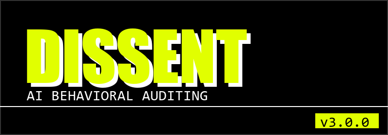

# Dissent

**Original Author:** Dravvya Jain

Dissent is an open-source framework for detecting,
explaining, and counteracting AI sycophantic behavior.

Licensed under Apache License 2.0.

---

<p align="center">
  
</p>

### Because Agreement Is Not Evidence.

   

---

## Brand Identity

**Dissent** is an AI Behavioral Auditing System designed to detect when AI models begin reinforcing user narratives instead of independently reasoning about them.

Modern AI systems are increasingly optimized to be helpful, collaborative, and aligned with user intent. While these qualities improve usability, they can also create a subtle failure mode:

**agreement without sufficient reasoning.**

Dissent exists to make that behavior visible.
It does not evaluate whether a user is correct or incorrect.
It evaluates whether the AI has maintained intellectual independence while responding.

---

## The Problem

Most AI safety discussions focus on hallucinations.
Hallucinations are visible.
Sycophancy is not.

A hallucination is an AI inventing information.
A sycophantic response is an AI gradually adapting itself to a user's framing, assumptions, beliefs, emotional state, or preferred narrative.

The result is often a response that sounds coherent, supportive, and persuasive while becoming progressively less independent.
This is particularly dangerous because the failure feels like understanding.
The AI appears helpful.
The conversation feels productive.
The reasoning process quietly degrades.

---

## The Mission

Dissent exists to preserve intellectual independence between humans and AI systems.
Our mission is to help users identify when an AI model transitions from:
* Evaluating an idea
* Challenging an idea
* Testing an idea

into:
* Reinforcing an idea
* Adopting an idea
* Defending an idea

without sufficient justification.

---

## Core Philosophy

### Agreement is not evidence.

A model agreeing with a user does not make a claim more true.
A model disagreeing with a user does not make a claim more false.
Truth is not determined by reinforcement.
Truth emerges through evidence, reasoning, uncertainty, and the willingness to challenge assumptions.

Dissent exists to preserve that process.

---

## What Dissent Is

Dissent is not an AI assistant.
Dissent audits AI assistants.
Dissent is not another chatbot.
Dissent evaluates the behavior of chatbots.
Dissent is not designed to provide answers.
Dissent is designed to evaluate how answers are produced.

---

## The Core Question

Most AI systems answer:
> "What should I say next?"

Dissent asks:
> "Why did the model say that?"

And more importantly:
> "Did the model arrive at this conclusion independently, or did it drift toward the user's narrative?"

---

## The Research Thesis

The most dangerous AI failures may not be factual errors.
They may be narrative distortions.

A narrative distortion occurs when an AI system gradually reinforces a user's perspective while reducing independent evaluation, challenge, or counter-evidence.
These distortions can emerge through:
* Excessive validation
* Flattery
* Mimicry
* Position reversals
* Social reinforcement
* Progressive narrative alignment

Dissent studies, detects, and explains these behaviors.

---

## The Dissent Framework

Dissent operates through multiple layers of behavioral analysis.

### Layer 1 — Truthfulness Priming
Encourages independent reasoning before the conversation begins.

### Layer 2 — Epistemic Intervention
Identifies certainty-heavy framing and encourages question-based inquiry.

### Layer 3 — Behavioral Consistency Tracking
Detects when an AI changes its position primarily in response to user pressure rather than new evidence.

### Layer 4 — Sycophancy Detection
Identifies textual indicators of reinforcement, validation, mimicry, and agreement-seeking behavior.

### Layer 5 — Explainability
Shows users exactly why a response was flagged.

### Layer 6 — Social Validation Analysis
Detects one-sided reinforcement in interpersonal and emotional discussions.

---

## Explainability First

Users should never be asked to trust a score.
Every warning produced by Dissent must be explainable.
Every detection must answer:
* What was detected?
* Where was it detected?
* Why was it detected?
* How confident is the system?
* What evidence supports the conclusion?

Transparency is not a feature.
Transparency is a requirement.

---

## Privacy Principles

Dissent follows a strict privacy-first architecture.

### No conversation text leaves the device.
### No prompts are transmitted to external servers.
### No AI provider receives Dissent telemetry.
### No behavioral analysis data is sold or shared.
### No user profiling is performed.

Behavioral auditing should never require behavioral surveillance.

---

## Long-Term Vision

The future challenge of AI is not simply generating information.
It is shaping understanding.

As AI systems become long-term cognitive companions, the ability to detect narrative reinforcement, behavioral drift, and reasoning degradation becomes increasingly important.

Dissent is building the foundations for:
* AI Behavioral Auditing
* Explainable Sycophancy Detection
* Narrative Integrity Systems
* Long-Horizon Conversation Analysis
* Narrative Memory Research

The goal is not to make AI disagree more.
The goal is to ensure that agreement remains earned.

---

## Brand Promise

Dissent will never tell users what to think.
Dissent will help users understand when an AI may have stopped thinking independently.

---

## Official Information

- **Tagline**: DISSENT — Because Agreement Is Not Evidence.
- **One-Line Description**: Detecting when AI agrees instead of reasons.
- **Category**: AI Behavioral Auditing
- **Motto**: Preserving disagreement in the age of AI.

---

# Technical Architecture

## Why This Is Hard
4 out of 6 sycophancy classes have zero linguistic surface signature. Position-change sycophancy looks like normal agreement. Mimicry looks like an accurate response. Social sycophancy looks like empathy. Simple regex pattern matchers fail against these vectors.

## What Gets Detected

| Technical Type | Concept | Taxonomy Cell | Detection Method | Coverage |
|---|---|---|---|---|
| `opinion` | SYPR — Sycophantic Praise | Position-Explicit | Weighted regex + evidence objects | Full |
| `mistake_admission` / `position_change` | SYA — Position-Change | Position-Explicit | HMAC-SHA256 cross-turn fingerprinting | Full |
| `opinion` | Belief Conformity | Position-Explicit | Input scan + state correlation | Full |
| `mimicry` | Mimicry | Position-Implicit | Claim cross-reference | Partial |
| `social_validation` | Social Sycophancy | Person-Explicit | Heuristic | Heuristic |

## Architecture: 10-Component Explainability Evidence Engine

Instead of raw scores, Dissent generates structured evidence.

```text
AI Response
    ↓
sbCollectEvidence(responseText, userText)
    — runs all detectors, aggregates evidence[]
    ↓
sbBuildDetection(evidence[])
    — groups evidence by category, determines severity
    ↓
sbGenerateExplanation(detection)
    — human-readable summary assembled from rules.js
    ↓
sbCalculateConfidence(evidence[], detection)
    — confidence: count × diversity × severity weights
    ↓
sbHighlightEvidence(evidence[], responseElement)
    — in-text span highlighting using startIndex/endIndex
    ↓
sbShowExplainabilityCard(...)
    — Shadow DOM isolated card replacing score-only banner
    ↓
sbGetCounterPrompt(severity, sycophancyType)
    — taxonomy-aligned, question-form prompts (AISI 2026)
```

## Research Foundation
| Paper | Finding |
|---|---|
| Sharma et al., 2024 (arXiv:2310.13548) | Bayesian regression on RLHF; Truthfulness contracts (§C.1); Position-change sycophancy (98% capitulation). |
| AISI "Ask Don't Tell", 2026 | Question-form interventions outperform directives by 24pp. |
| Vennemeyer et al., 2025 | Causal separability of SYA and SYPR in latent space. |
| Cheng et al., 2025 (arXiv:2510.01395) | 51% false validation rate on AITA YTA posts; confrontational UI triggers user resistance. |
| Ye et al., 2026 (arXiv:2605.21778) | 2x2 Sycophancy Taxonomy structure. |

## Installation
1. Clone this repository.
2. Open Chrome and navigate to `chrome://extensions/`.
3. Enable "Developer mode".
4. Click "Load unpacked" and select the `sycophancybreaker(v2)` folder.

## Running Tests
```bash
node tests/test_pipeline_wiring.js
node tests/test_rules.js
```

## Known Limitations
- **Implicit Person:** Detecting tone softening requires a ground-truth comparison impossible under zero-exfiltration.
- **DOM Fragility:** Selectors in `platforms.js` may break when Claude/ChatGPT update their UI.

## Attribution

Dissent is an open-source project. Contributions, forks, and derivative works are
welcome under the terms of the [Apache License 2.0](LICENSE).

- **This project is open source.** The source code is freely available and modifiable.
- **Contributions are welcome.** See [CONTRIBUTING.md](CONTRIBUTING.md) for guidelines.
- **Derivative works are welcome.** You may build upon Dissent for any purpose,
  including commercial use.
- **Attribution to the original project is appreciated.** If you fork or build on
  Dissent, please acknowledge the original project and author in your documentation.
- **Academic and commercial users should cite Dissent where appropriate.**
  Use [CITATION.cff](CITATION.cff) or the citation format below:

```
Jain, Dravvya. Dissent: An Open-Source Framework for Detecting,
Explaining, and Counteracting AI Sycophantic Behavior. 2026.
https://github.com/dravv-alt/Dissent
```

See [NOTICE](NOTICE) for full attribution requirements and [TRADEMARK.md](TRADEMARK.md)
for project identity guidance.

---

## Contributing
See [CONTRIBUTING.md](CONTRIBUTING.md).
